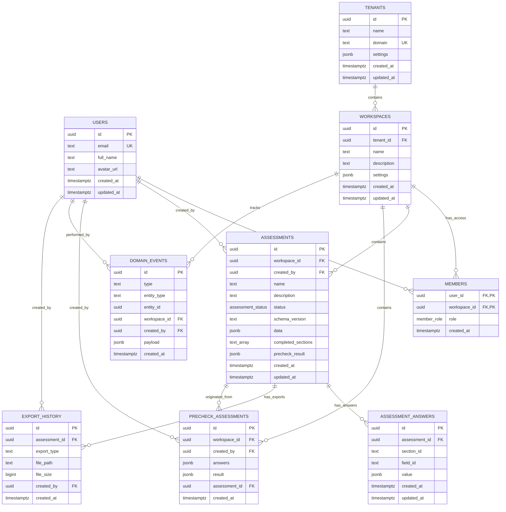
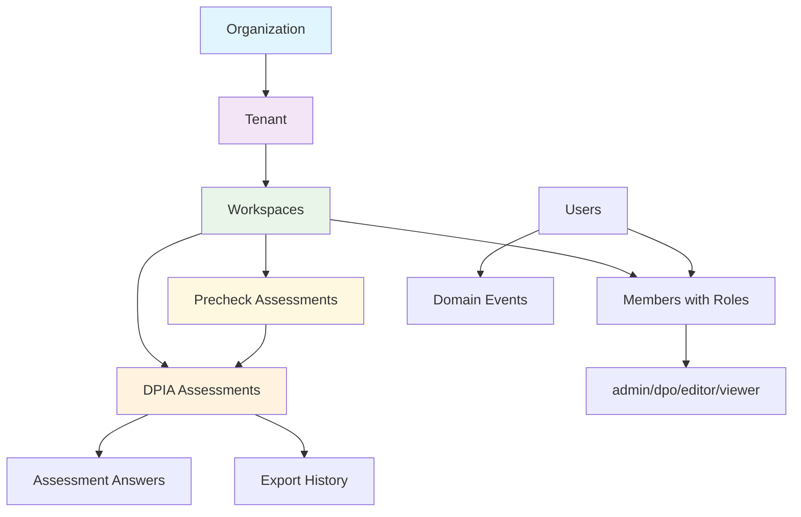

# Database Schema & Data Model (v3.21.178)

## Platform Overview Architecture Integration

This database schema supports the **Unified Platform Overview** architecture with compliance scoring across five modules: Context(25%), Privacy(30%), Risk(20%), Controls(15%), and Training(10%) = 92% overall compliance score.

## Entity Relationship Diagram



## Multi-Tenant Architecture Flow



## Data Dictionary

### Core Tables

#### `users` Table
| Column | Type | Nullable | Default | Description |
|--------|------|----------|---------|-------------|
| `id` 🔑 | `uuid` | NOT NULL | - | **Primary Key** - References Supabase auth.users(id) |
| `email` 🔒 | `text` | NOT NULL | - | **Unique** - User email address |
| `full_name` | `text` | NULL | - | User's full display name |
| `avatar_url` | `text` | NULL | - | URL to user's profile image |
| `created_at` | `timestamptz` | NOT NULL | `now()` | Account creation timestamp |
| `updated_at` | `timestamptz` | NOT NULL | `now()` | Last profile update timestamp |

**Purpose**: Extends Supabase Auth with additional profile information
**Relationships**: One-to-many with members, assessments, domain_events

---

#### `tenants` Table
| Column | Type | Nullable | Default | Description |
|--------|------|----------|---------|-------------|
| `id` 🔑 | `uuid` | NOT NULL | `uuid_generate_v4()` | **Primary Key** - Unique organization identifier |
| `name` | `text` | NOT NULL | - | Organization display name |
| `domain` 🔒 | `text` | NULL | - | **Unique** - Organization's domain (e.g., 'company.com') |
| `settings` | `jsonb` | NOT NULL | `'{}'` | Organization-level configuration and preferences |
| `created_at` | `timestamptz` | NOT NULL | `now()` | Organization registration timestamp |
| `updated_at` | `timestamptz` | NOT NULL | `now()` | Last organization update timestamp |

**Purpose**: Top-level multi-tenancy container for organizations
**Settings Examples**: `{"branding": {"logo": "url"}, "features": {"advanced_export": true}}`

---

#### `workspaces` Table
| Column | Type | Nullable | Default | Description |
|--------|------|----------|---------|-------------|
| `id` 🔑 | `uuid` | NOT NULL | `uuid_generate_v4()` | **Primary Key** - Unique workspace identifier |
| `tenant_id` 🔗 | `uuid` | NOT NULL | - | **Foreign Key** to `tenants(id)` - Parent organization |
| `name` | `text` | NOT NULL | - | Workspace display name (e.g., 'Marketing Department') |
| `description` | `text` | NULL | - | Optional workspace description |
| `settings` | `jsonb` | NOT NULL | `'{}'` | Workspace-specific configuration |
| `created_at` | `timestamptz` | NOT NULL | `now()` | Workspace creation timestamp |
| `updated_at` | `timestamptz` | NOT NULL | `now()` | Last workspace update timestamp |

**Purpose**: Project/department-level container within organizations
**Use Cases**: Different departments, projects, or business units needing separate DPIA management

---

#### `members` Table
| Column | Type | Nullable | Default | Description |
|--------|------|----------|---------|-------------|
| `user_id` 🔑🔗 | `uuid` | NOT NULL | - | **Primary Key** + **Foreign Key** to `users(id)` |
| `workspace_id` 🔑🔗 | `uuid` | NOT NULL | - | **Primary Key** + **Foreign Key** to `workspaces(id)` |
| `role` | `member_role` | NOT NULL | `'viewer'` | **ENUM** - User's permission level in workspace |
| `created_at` | `timestamptz` | NOT NULL | `now()` | Membership creation timestamp |

**Purpose**: Join table defining user access and permissions within workspaces
**Composite Primary Key**: `(user_id, workspace_id)` ensures unique user-workspace relationships

**Role Definitions**:
- `admin` - Full workspace management, user management
- `dpo` - Data Protection Officer level access, full DPIA management
- `editor` - Can create and edit assessments, cannot manage users
- `viewer` - Read-only access to assessments and reports

---

### Assessment Tables

#### `assessments` Table
| Column | Type | Nullable | Default | Description |
|--------|------|----------|---------|-------------|
| `id` 🔑 | `uuid` | NOT NULL | `uuid_generate_v4()` | **Primary Key** - Unique assessment identifier |
| `workspace_id` 🔗 | `uuid` | NOT NULL | - | **Foreign Key** to `workspaces(id)` - Parent workspace |
| `created_by` 🔗 | `uuid` | NULL | - | **Foreign Key** to `users(id)` - Assessment creator |
| `name` | `text` | NOT NULL | - | Assessment display name |
| `description` | `text` | NULL | - | Optional assessment description |
| `status` | `assessment_status` | NOT NULL | `'draft'` | **ENUM** - Current assessment workflow status |
| `schema_version` | `text` | NOT NULL | `'dpia-basic-eu-v1'` | Template version used for assessment structure |
| `data` | `jsonb` | NOT NULL | `'{}'` | Flexible storage for assessment-wide metadata |
| `completed_sections` | `text[]` | NOT NULL | `'{}'` | Array of section IDs marked as complete |
| `precheck_result` | `jsonb` | NULL | - | Results from precheck assessment if applicable |
| `created_at` | `timestamptz` | NOT NULL | `now()` | Assessment creation timestamp |
| `updated_at` | `timestamptz` | NOT NULL | `now()` | Last assessment modification timestamp |

**Purpose**: Main DPIA assessment container with workflow tracking

**Status Workflow**:
- `draft` - Initial state, can be edited freely
- `in_progress` - Active development, auto-saves enabled
- `in_review` - Submitted for review, restricted editing
- `completed` - Finalized assessment, ready for export
- `archived` - Historical record, read-only

**Schema Versions**: Future-proof versioning for template evolution
**Data Examples**: `{"risk_score": 75, "compliance_notes": "Additional measures required"}`

---

#### `assessment_answers` Table
| Column | Type | Nullable | Default | Description |
|--------|------|----------|---------|-------------|
| `id` 🔑 | `uuid` | NOT NULL | `uuid_generate_v4()` | **Primary Key** - Unique answer identifier |
| `assessment_id` 🔗 | `uuid` | NOT NULL | - | **Foreign Key** to `assessments(id)` - Parent assessment |
| `section_id` | `text` | NOT NULL | - | Form section identifier (e.g., 'context_scope') |
| `field_id` | `text` | NOT NULL | - | Field identifier within section |
| `value` | `jsonb` | NOT NULL | - | User's response data (any type: string, array, object) |
| `created_at` | `timestamptz` | NOT NULL | `now()` | Initial answer timestamp |
| `updated_at` | `timestamptz` | NOT NULL | `now()` | Last answer modification timestamp |

**Purpose**: Flexible storage for form responses from dynamic JSON templates
**Unique Constraint**: `(assessment_id, section_id, field_id)` prevents duplicate answers

**Value Examples**:
- Text: `"Customer support processing"`
- Array: `["Personal identifiers", "Contact information"]`
- Boolean: `true`
- Object: `{"retention_period": 12, "unit": "months"}`

---

#### `precheck_assessments` Table
| Column | Type | Nullable | Default | Description |
|--------|------|----------|---------|-------------|
| `id` 🔑 | `uuid` | NOT NULL | `uuid_generate_v4()` | **Primary Key** - Unique precheck identifier |
| `workspace_id` 🔗 | `uuid` | NULL | - | **Foreign Key** to `workspaces(id)` - Parent workspace |
| `created_by` 🔗 | `uuid` | NULL | - | **Foreign Key** to `users(id)` - Precheck creator |
| `answers` | `jsonb` | NOT NULL | - | User responses to precheck questionnaire |
| `result` | `jsonb` | NOT NULL | - | Evaluation result with recommendations |
| `assessment_id` 🔗 | `uuid` | NULL | - | **Foreign Key** to `assessments(id)` - Linked full DPIA if created |
| `created_at` | `timestamptz` | NOT NULL | `now()` | Precheck completion timestamp |

**Purpose**: Quick DPIA necessity evaluation (8-question assessment)

**Answers Structure**: `{"q1": "yes", "q2": "high", "q3": ["automated_decision"]}`
**Result Structure**: `{"recommendation": "full_dpia_required", "score": 85, "rationale": "High risk processing"}`

---

### System Tables

#### `domain_events` Table
| Column | Type | Nullable | Default | Description |
|--------|------|----------|---------|-------------|
| `id` 🔑 | `uuid` | NOT NULL | `uuid_generate_v4()` | **Primary Key** - Unique event identifier |
| `type` | `text` | NOT NULL | - | Event type classification |
| `entity_type` | `text` | NOT NULL | - | Target entity type (e.g., 'assessment') |
| `entity_id` | `uuid` | NOT NULL | - | Target entity identifier |
| `workspace_id` 🔗 | `uuid` | NULL | - | **Foreign Key** to `workspaces(id)` - Context workspace |
| `created_by` 🔗 | `uuid` | NULL | - | **Foreign Key** to `users(id)` - Event performer |
| `payload` | `jsonb` | NOT NULL | `'{}'` | Event-specific data and context |
| `created_at` | `timestamptz` | NOT NULL | `now()` | Event occurrence timestamp |

**Purpose**: Audit trail and system event logging for compliance
**Event Types**: `assessment.created`, `assessment.completed`, `export.generated`, `member.added`

**Payload Examples**:
- `{"section": "risk_assessment", "changes": {"risk_level": "high"}}`
- `{"export_format": "pdf", "sections": ["all"]}`

---

#### `export_history` Table
| Column | Type | Nullable | Default | Description |
|--------|------|----------|---------|-------------|
| `id` 🔑 | `uuid` | NOT NULL | `uuid_generate_v4()` | **Primary Key** - Unique export identifier |
| `assessment_id` 🔗 | `uuid` | NOT NULL | - | **Foreign Key** to `assessments(id)` - Source assessment |
| `export_type` | `text` | NOT NULL | - | Export format ('pdf', 'docx', 'json') |
| `file_path` | `text` | NULL | - | Storage path for generated file |
| `file_size` | `bigint` | NULL | - | File size in bytes |
| `created_by` 🔗 | `uuid` | NULL | - | **Foreign Key** to `users(id)` - Export requester |
| `created_at` | `timestamptz` | NOT NULL | `now()` | Export generation timestamp |

**Purpose**: Track document generation for audit and file management

---

## Database Enums

### `assessment_status` Enum
```sql
CREATE TYPE assessment_status AS ENUM (
    'draft',        -- Initial editable state
    'in_progress',  -- Active development with auto-save
    'in_review',    -- Submitted for review, restricted editing
    'completed',    -- Finalized and ready for export
    'archived'      -- Historical record, read-only
);
```

### `member_role` Enum
```sql
CREATE TYPE member_role AS ENUM (
    'admin',    -- Full workspace management
    'dpo',      -- Data Protection Officer access
    'editor',   -- Assessment creation and editing
    'viewer'    -- Read-only access
);
```

## Indexes for Performance

### Primary Performance Indexes
```sql
-- Assessment queries
CREATE INDEX idx_assessments_workspace_id ON assessments(workspace_id);
CREATE INDEX idx_assessments_status ON assessments(status);
CREATE INDEX idx_assessments_created_at ON assessments(created_at);

-- Form answer queries  
CREATE INDEX idx_assessment_answers_assessment_id ON assessment_answers(assessment_id);
CREATE INDEX idx_assessment_answers_section_id ON assessment_answers(assessment_id, section_id);

-- Workspace and member queries
CREATE INDEX idx_precheck_assessments_workspace_id ON precheck_assessments(workspace_id);

-- Audit and event queries
CREATE INDEX idx_domain_events_entity ON domain_events(entity_type, entity_id);
CREATE INDEX idx_domain_events_workspace_id ON domain_events(workspace_id);

-- Export tracking
CREATE INDEX idx_export_history_assessment_id ON export_history(assessment_id);
```

## Row Level Security (RLS)

### Security Model
All tables implement Row Level Security to enforce multi-tenant data isolation:

- **Workspace Isolation**: Users can only access data within workspaces where they are members
- **Role-Based Permissions**: Create/Update operations restricted based on member roles
- **Cascading Security**: Assessment answers inherit security from parent assessment's workspace

### Key RLS Policies
```sql
-- Users can only view workspaces they're members of
CREATE POLICY "Users can view own workspaces" ON workspaces
FOR SELECT USING (
    id IN (SELECT workspace_id FROM members WHERE user_id = auth.uid())
);

-- Role-based assessment creation (admin, dpo, editor only)
CREATE POLICY "Users can create assessments in their workspaces" ON assessments
FOR INSERT WITH CHECK (
    workspace_id IN (
        SELECT workspace_id FROM members 
        WHERE user_id = auth.uid() 
        AND role IN ('admin', 'dpo', 'editor')
    )
);
```

## Data Flow Architecture

### Assessment Creation Flow
1. User creates `assessment` in workspace (role check: admin/dpo/editor)
2. Form responses stored as `assessment_answers` (flexible JSON)
3. Progress tracked in `assessments.completed_sections`
4. Events logged to `domain_events` for audit trail
5. Export generation tracked in `export_history`

### Multi-Tenancy Flow
1. Organization → `tenant` record
2. Departments/Projects → `workspaces` within tenant
3. User access → `members` with role-based permissions
4. Data isolation enforced through RLS policies

This schema supports enterprise-grade privacy management with flexible form storage, comprehensive audit trails, and secure multi-tenant architecture.